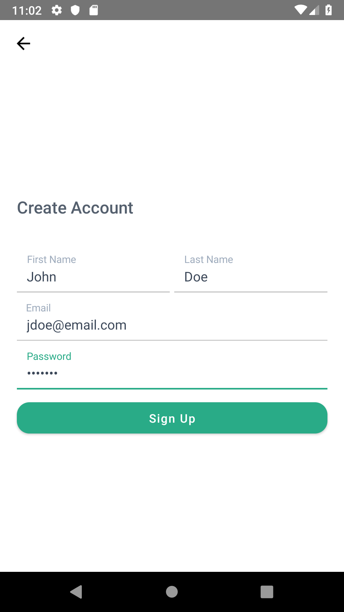
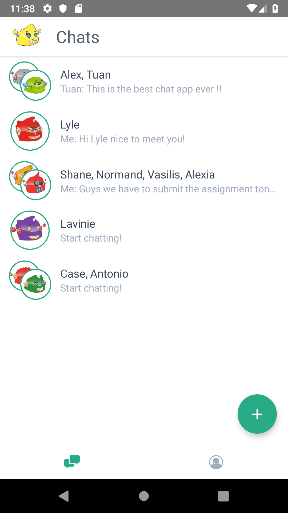
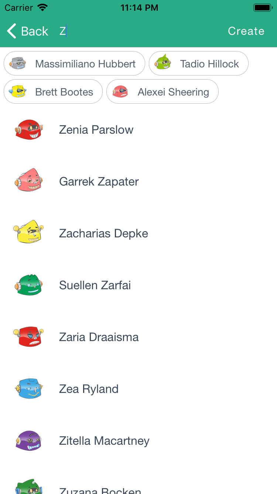
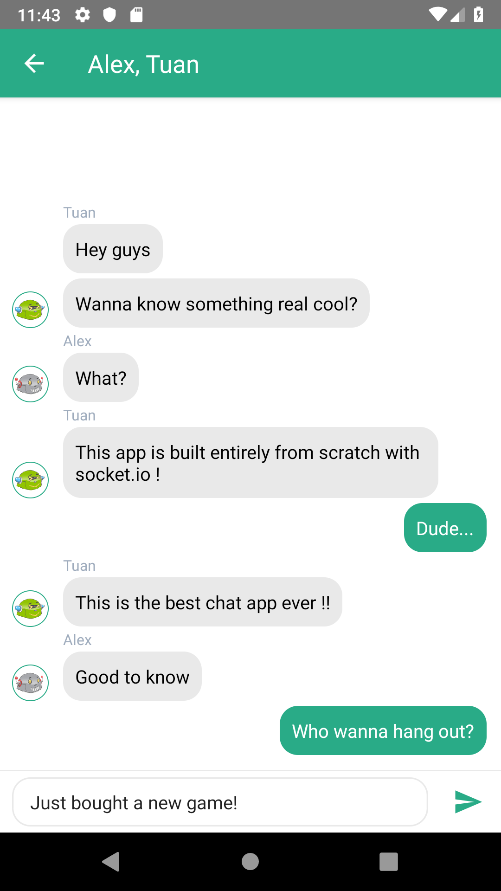

# Zenio

>Yet another real-time chat application project! :sparkles::sparkles:

Written from scratch with :sparkling_heart:. Powered by NodeJS, socket.io :zap: and React Native :fire::fire:

Check out the server [here](https://github.com/tuanle99/zenio-server) :smirk:

        
        
